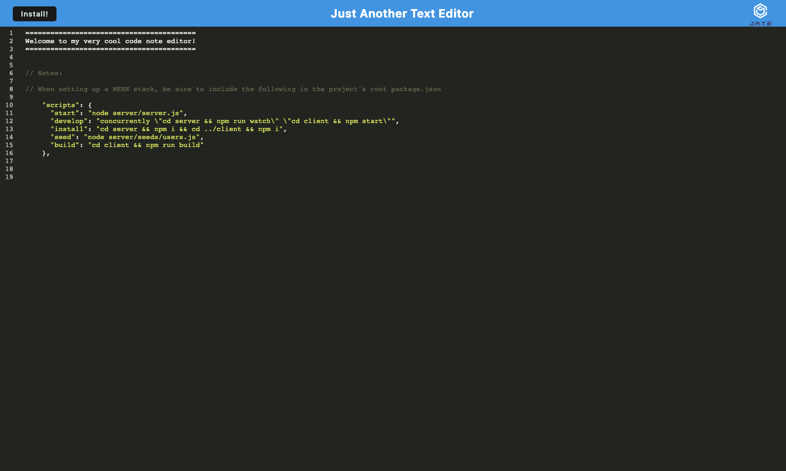
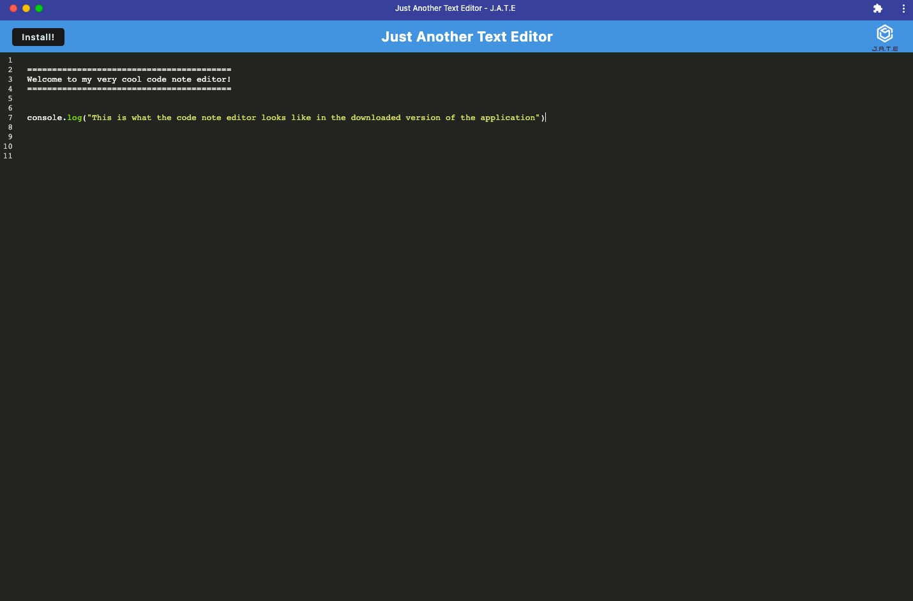

# Code Note Editor

## Description

The Code Note Editor, also known as 'Just Another Text Editor', is a progressive web application. The user can take code notes in the text editor with or without an internet connection. This application functions in the browser and it may also be downloaded to the user's desktop. Notes get saved to IndexedDB so they are not lost after exiting and returning to the application.

## Table of Contents

- [Installation](#installation)
- [Usage](#usage)
- [License](#license)
- [Contributing](#contributing)
- [Tests](#tests)
- [Questions](#questions)

## Installation 

Installation is not required as this application has been deployed to Heroku. To see it in action, please visit the link below.

To install locally, clone the code in this repository and run `npm install` to install the required packages. Next, run `npm run start` from the root directory to start the backend and serve the client. Once complete, the application will run on localhost:3000. 

## Usage 

The Code Note Editor is easy to use and convenient due to it being a progressive web application. 

* It can be used in the browser or installed by clicking the install button on the home screen. 

* Installing will download the application to the user's desktop and an icon will appear.

It can be used with or without an internet connection by utilizing data persistance techniques. 

* Data is stored to an IndexedDB database. 

* If the application is closed and then reopened, content that was previously entered will be retrieved from IndexedDB.

Taking notes in the Code Note Editor is convenient because it has a similar feel to VS Code.

* It uses the same formatting techniques and allows for a nice visualization of the code notes.

[Deployed Application](https://code-note-editor.herokuapp.com/)

Screenshot of the application in the browser:

Screenshot of the downloaded desktop application:

## License 

The Code Note Editor is available under the MIT license.

Please see [LICENSE](./LICENSE) for the full details of the license.

## Contributing 

The contributors of this application have adopted the Contributor Covenant Code of Conduct. Please visit the [Code of Conduct](./CODE_OF_CONDUCT) page for details.

## Tests 

This application doesn't have any tests at this time.

## Questions 

Please reach out via the the link below with any additional questions. 

[GitHub](https://github.com/smdann)
